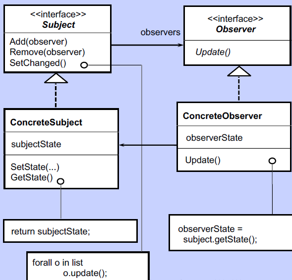

# OBSERVER Design Pattern in C++
It is a Behavioural design pattern i.e. deals with
communication between objects. Also, called publisher - subscriber pattern

### Key problem that the pattern solves:
a) Consider a case where a subject/publisher changes state and one or more 
objects/subscriber wish to know the change of state of subject. 
In such a situation, an observer design pattern is used.

b) Note that: 
1) Master/subject does not know number and types of dependents/objects
2) Subject and object are not related by inheritance
3) Dependents (observers) can be added and removed dynamically

c) The pattern is used by listeners, even handlers, etc. NOTE that it is 
used to support Model-View (in MVC). Model acts as subject and views acts as observers.

### Key architecture ideas:
1. Subject inherits from an Abstract class/interface. It provides
add/remove(observers) API and consists of setChanged/notify() method that
runs the update() method of all the observers
2. Object inherits from Abstract class/interface too and provides the update()
method that is called by the subject whenever it see any change of state
3. Use of Abstract methods increases the extensibility and maintainability.
It helps to store objects of different classes in the same list

prof. Ugo Buy's CS478 class presentation

## C++ specific implementation details
1. Note that the pointers to 'observers Abstract class' will be used so that message
polymorphism (virtual) can be used.
2. The abstract observer pointers are able to point to observer instances
as these instances inherit from the abstract class (identifier polymorphism)
3. Remember to use Virtual so as to inherit member functions from abstract class
