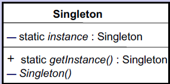

# Singleton Design Pattern(C++)
###  1. Problem that the pattern solves
In an application, we need a unique instance of a specific class.
For example, in a mobile app, the OS wants only 1 instance of messaging class.
So, when a constructor of the class is called, a new instance is created only if no instance exists

### 2. Class diagram

source - PPT of CS478 by Prof. Ugo Buy

### 3. Explanation
This design pattern uses:
- A private static member variable (X) to hold the unique instance
- The constructor is private so clients cannot access to create any new instance
- A public static member function - getInstance() - creates an instance if none exists
else just passes the instance held by X